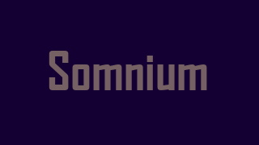

    <h1>Somnium</h1>
    

## What is it about?

Somnium is a 2D platformer with pixel art aesthetics based on a baby's journey through his home. In Somnium, you must alternate between the dream and nightmare dimensions to overcome obstacles, using power-ups to find the missing mother of Eric, the magical baby.

> Check the [Game Design Document](https://docs.google.com/document/d/1oA3fnJV3PdR0l84_BQ2afU1-UNV_-LvPpQOJAdWs4Rg/edit?usp=sharing) for more info.

## Want to contribute?

- Create a fork on my repository.
- Clone the repository to your PC.
- Create a new branch and make the changes you want, adding documentation.
- Push the changes to your repository and send a Pull Request.

## License

_MIT_

## Contact me

 |  | 
